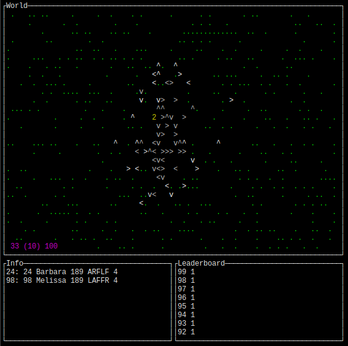
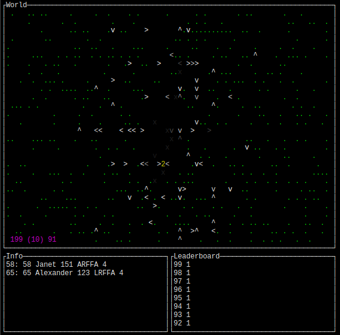

## Overview

This is a little experiment of mine where I wanted to make a simulated world
with actors that could evolve and mutate in response to changes in their
environment.

## Screenshots

<p align="center">
  
  
</p>

## Features

- Simulated world that demonstrates evolution through iterative culling
- Simulated reproduction, mutation, aging, and death
- Interactive TUI and `stdout` visualizations
- Logging with `log4rs`
- Individual creatures with behaviors and attributes influenced by a genetic code
- Customizable environments and incentive structures
- Histogram to visualize which strains are thriving
- Window to inspect creatures during runtime to see ID, name, and genetic code
- Simulation replay system that can be paused, rewound, sped up, or slowed down

## Controls

| Key                     | Action                                           |
|-------------------------|--------------------------------------------------|
| Space, p                | Pause/resume the simulation.                     |
| ,                       | Rewind one simulation frame.                     |
| .                       | Progress one simulation frame.                   |
| h, j, k, l / Arrow keys | Move the cursor (cursor is visible when paused). |
| [, ]                    | Speed up or slow down playback.                  |
| d                       | Toggle showing dead creatures.                   |
| q, Escape               | Terminate the program.                           |

## Usage

```
cargo run
```

## License

This work is licensed under the GNU General Public License version 3 (GPLv3).

[](https://www.gnu.org/licenses/gpl-3.0.en.html)
